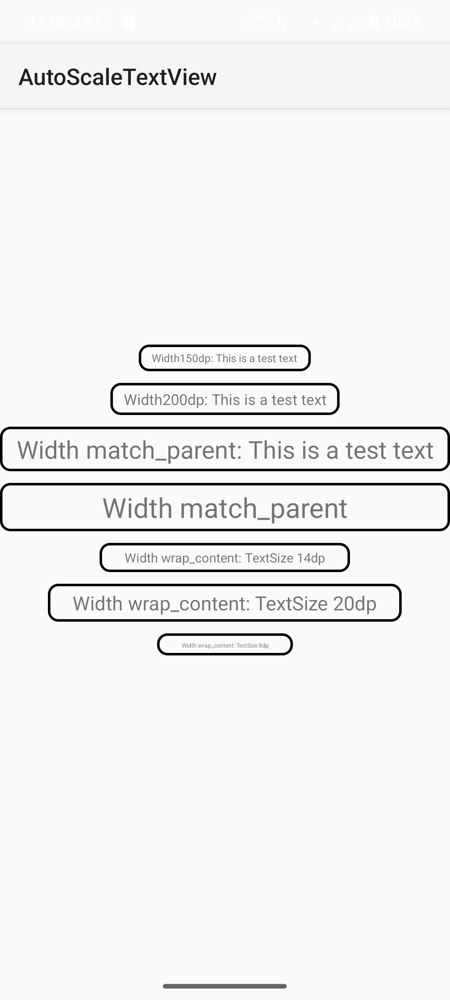

English [中文](./README_CN.md)
# Usage
Step1: Add it in your root settings.gradle at the end of repositories:
```groovy
dependencyResolutionManagement {
    repositoriesMode.set(RepositoriesMode.FAIL_ON_PROJECT_REPOS)
    repositories {
        mavenCentral()
        maven { url 'https://jitpack.io' }
    }
}
```

Step2: Add the dependency
```groovy
dependencies {
    implementation 'tech.qingge.lib:AutoScaleTextView:1.1'
}
```

Step3: Use in xml
```xml
<tech.qingge.lib.astv.AutoScaleTextView
    android:layout_width="200dp"
    android:layout_height="wrap_content"
    android:text="Width200dp: This is a test text"
    app:maxTextSize="24dp"
    app:minTextSize="12dp" />
```

# Screenshots
