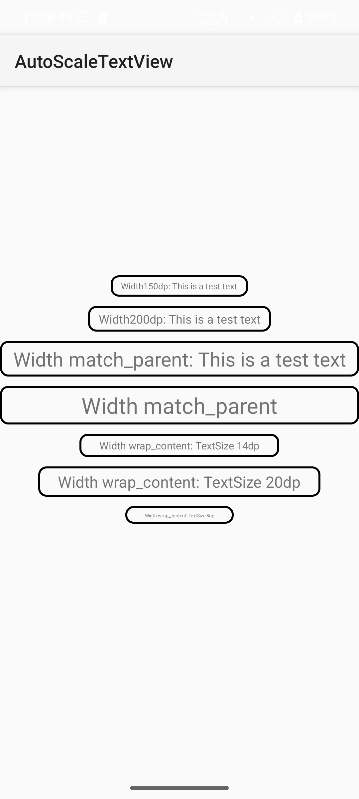

[English](./README.md) 中文
# 使用
步骤1: 添加到根目录settings.gradle的结尾 
```groovy
dependencyResolutionManagement {
    repositoriesMode.set(RepositoriesMode.FAIL_ON_PROJECT_REPOS)
    repositories {
        mavenCentral()
        maven { url 'https://jitpack.io' }
    }
}
```

步骤2: 添加依赖
```groovy
dependencies {
    implementation 'tech.qingge.lib:AutoScaleTextView:1.0'
}
```

步骤3: 在xml中使用
```xml
<tech.qingge.lib.astv.AutoScaleTextView
    android:layout_width="200dp"
    android:layout_height="wrap_content"
    android:text="Width200dp: This is a test text"
    app:maxTextSize="24dp"
    app:minTextSize="12dp" />
```


# 截图
